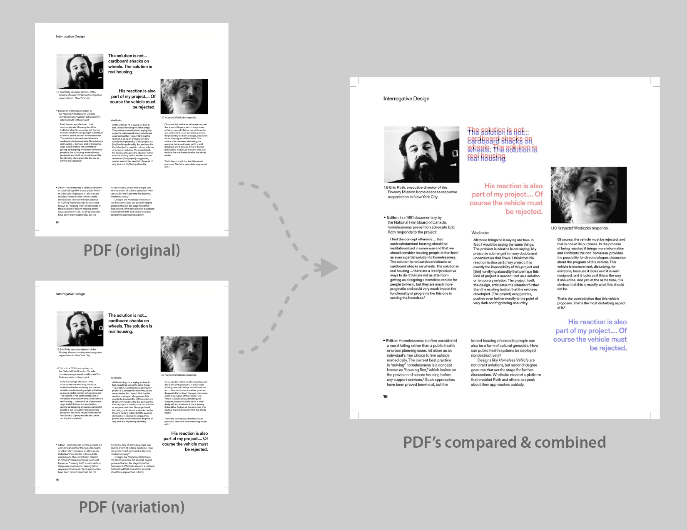

vdiff
=====

A tool for comparing similar PDFs and highlighting differences. 
The system reduces both PDFs to greyscale and renders an output PDF with 
additions in blue, subtractions in red, and unchanged areas in grey. 

Example
-------



Prerequisites
-------------

Requires imagemagick, ghostscript, and poppler. On macOS, you can install it with:

```
/bin/bash -c "$(curl -fsSL https://raw.githubusercontent.com/Homebrew/install/HEAD/install.sh)"
brew install imagemagick ghostscript poppler
```

Usage
-----

`./vdiff <pdf 1> <pdf 2> <output pdf> [--use-cache]`

The `--use-cache` flag speeds up subsequent runs by reusing previously rendered process files. Delete the `cache` folder or remove the flag to rerender from scratch.

